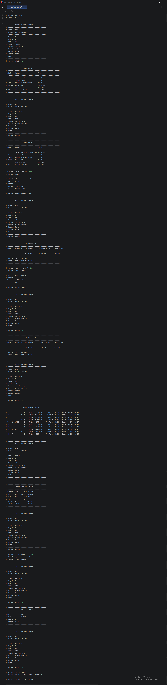

# CodeAlpha Stock Trading Platform

## About the Project

Stock Trading Platform is a Java-based application developed as part of the CodeAlpha Java Programming Internship.

The application allows users to view stock details, buy and sell stocks, manage their portfolio, and track transactions.

## Features

- View available stocks
- View stock market information
- Buy stocks
- Sell stocks
- Manage portfolio holdings
- Track transactions
- Display portfolio information

## Technologies Used

- Java
- Object-Oriented Programming (OOP)
- Console-based Application

## How to Run

1. Clone or download this repository.
2. Open the project in IntelliJ IDEA or any Java IDE.
3. Open the "StockTradingPlatform.java" file.
4. Compile and run the program.
5. Enter the required details when prompted.

## Sample Output



## Project Structure

```text
CodeAlpha_StockTradingPlatform
│
├── src
│   ├── DataManager.java
│   ├── Holding.java
│   ├── Portfolio.java
│   ├── Stock.java
│   ├── StockMarket.java
│   ├── StockTradingPlatform.java
│   ├── Transaction.java
│   └── User.java
│
├── screenshots
│   └── stpoutput.png
│
└── README.md
